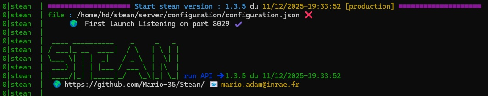
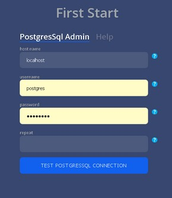

# SensorThings Enhanced API Node [](https://github.com/Mario-35/Stean/blob/main/realease.md) [](https://github.com/Mario-35/Stean?tab=MIT-1-ov-file#readme)

## Installation / Deploy  [](https://nodejs.org/) [](https://www.postgresql.org/) [](https://postgis.net/) [](https://pm2.keymetrics.io/)


You must have curl installed on your server.

This script will install NodeJS, PostgresSql17 with PostGis, create default user and params for postgesSql, pm2 and create run.sh script

<details>
    <summary>If you need help</summary>

# Install cURL on Linux/Windows/MacOSX

## Linux installation

1.Access the computer's terminal.
2.Run the command below in the terminal:

```
sudo apt-get install curl
```
3.If a password is required after running the command, please enter your computers' user password to continue.Then, wait until the installation finishes.

Now you are able to use cURL from your Linux PC!
​
## Windows Installation 

1.Enter and access the URL https://curl.haxx.se/ to download the curl executable wizard.

2.Then, on the "Select Operating System" section, select Windows.Then, continue selecting the parameters required based on your version of Windows.

3.Once you've finished the on-screen steps, download the ZIP file generated.To download it, simply press "Download".

4.Next, open the .zip file and enter to the folder called "src".Inside the src folder you will find the curl executable file.At this point, you need to copy the executable file and paste it inside a local folder on your PC to be able to run the curl.

NOTE: To get a better understanding of the following steps, let's assume the executable file is located inside a folder named "programs".

6.From the Command Prompt, enter to the location where the executable file was pasted.To enter to the folder you need to use the cd command following the location of the folder which contains the executable file as you can see below.

```
cd programs
```
Expected location to be shown
 
```
C:\Users\{your_user}\programs>
```

7.To verify if you are able to run curl commands with the command prompt, test its functionality by executing the command below:

```
curl --help
```

At this point, you should receive all the help info related to the curl command.
​
Now you are able to use cURL from your Windows PC!

 
## MacOSX Installation

1.Access the computer's terminal.
2.Run the command below in the terminal:
```
ruby -e "$(curl -fsSL https://raw.githubusercontent.com/Homebrew/install/master/install)" < /dev/null 2> /dev/null
```
3.If a password is required after running the command, please enter your Mac's user password to continue.Then, wait until the installation finishes.
4.Run the command below in the terminal:
```
brew install curl
```

Now you are able to use cURL from your Mac PC!
</details>


```
curl -fsSL https://raw.githubusercontent.com/Mario-35/Stean/refs/heads/main/scripts/stean.sh -o stean.sh && chmod +x stean.sh && ./stean.sh
```


## Running

after install if all is good run 
```
./run.sh
```

you have something like this :



http://localhost:8029/help show the documentation

http://localhost:8029/admin (to admin stean and install services)

To access admin panel you hawe to be indentified with admin postgres access enter on installatitg process.



## use on local windows as production (for testing)

You must have postgresSql with postGis installed.

use :  [script](./scripts/install.ps1) as install.ps1

## for developper

1. Fork/Clone : <https://github.com/Mario-35/Stean.git>
2. Install dependencies : npm install
3. Fire up Postgres WITH Postgis on the default ports
4. npm run dev for dev, npm run build (vs script package.json)

## Want to use this with docker


<details>
    <summary>Tech Stack</summary>

The project run under nodeJS.


 


## Directory Structure

```js
📦src
 ┣ 📂server // API Server
 ┃ ┣ 📂authentication // authentication and tokens
 ┃ ┣ 📂configuration // Configuration Server
 ┃ ┃ ┣ 📜.key // crypt Key
 ┃ ┃ ┗ 📜 configuration.json // configuration file
 ┃ ┣ 📂db
 ┃ ┃ ┣ 📂createDb // datas to create blank Database
 ┃ ┃ ┣ 📂dataAccess
 ┃ ┃ ┣ 📂entities // SensorThings entities
 ┃ ┃ ┣ 📂helpers 
 ┃ ┃ ┣ 📂monitoring 
 ┃ ┃ ┣ 📂queries
 ┃ ┃ ┗ 📜constants.ts // Constants for DB
 ┃ ┣ 📂enums // Enums datas
 ┃ ┣ 📂helpers // Application helpers
 ┃ ┣ 📂log // Logs tools
 ┃ ┣ 📂lora // loras functions
 ┃ ┣ 📂messages //all messages of the api
 ┃ ┣ 📂models //model descriptor
 ┃ ┣ 📂odata // Odata decoder
 ┃ ┃ ┣ 📂parser // Odata parser
 ┃ ┃ ┗ 📂visitor //  Odata decoder process
 ┃ ┃   ┣📂builder //  Odata builder process
 ┃ ┃   ┣📂helper  //  Odata helpers
 ┃ ┃   ┗📂pg  //  Odata postgres visitor
 ┃ ┣ 📂routes // routes API
 ┃ ┃ ┗ 📂helper // routes helpers
 ┃ ┃   ┣ 📜protected.ts // protected routes
 ┃ ┃   ┗ 📜unProtected.ts // open routes
 ┃ ┣ 📂types // data types
 ┃ ┣ 📂views // generated view
 ┃ ┃ ┣ 📂clas // class files
 ┃ ┃ ┣ 📂css
 ┃ ┃ ┣ 📂helpers // views helpers
 ┃ ┃ ┣ 📂html 
 ┃ ┃ ┗ 📂js
 ┃ ┣ 📜constants.ts // App constants
 ┃ ┗ 📜index.ts // starting file
 ┣ 📂test
 ┃ ┣ 📂integration // Tests
 ┃ ┃ ┗ 📂files // files For importation tests
 ┃ ┗ 📜dbTest.ts // DB test connection
 ┗ 📜build.js // js file for building app
```

- [Node.js](https://nodejs.org/) `v18.15.0`
- [PostgreSQL](https://www.postgresql.org/)
- [Postgres.js](https://github.com/porsager/postgres)
- [json2csv](https://mircozeiss.com/json2csv/)
- [busboy](https://github.com/mscdex/busboy)
- [jsonwebtoken](https://github.com/auth0/node-jsonwebtoken)
- [exceljs](https://github.com/exceljs/exceljs)
- [ssh2](https://github.com/mscdex/ssh2)

---

- [koa](https://koajs.com/)
- [koa-bodyparser](https://github.com/koajs/bodyparser)
- [koa-bodyparser](https://github.com/koajs/cors)
- [koa-compress](https://github.com/koajs/compress)
- [koa-html-minifier](https://github.com/koajs/html-minifier)
- [koa-json](https://github.com/koajs/json)
- [koa-helmet](https://github.com/venables/koa-helmet)
- [koa-logger](https://github.com/koajs/logger)
- [koa-router](https://github.com/koajs/router)
- [koa-session](https://github.com/koajs/session)
- [koa-passport](https://github.com/rkusa/koa-passport)
- [koa-static](https://github.com/koajs/static)
- [koa-favicon](https://github.com/koajs/favicon)
- [@koa/cors](https://github.com/koajs/cors)
- [passport-local](https://github.com/jaredhanson/passport-local)

</details>
