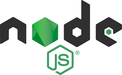
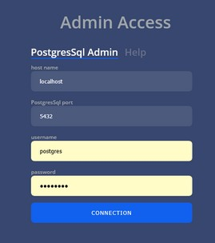

# [STEAN](/intro.md)

## Installation :

Installer / déployer STEAN est très simple :
```
curl -fsSL ../scripts/stean.sh -o stean.sh && chmod +x stean.sh && ./stean.sh
```

Lance le script qui installera NodeJS, PostgreSQL / PostGis, PM2 et enfin créera le script run.sh permettant de lancer STEAN.




La mise à jour ce fait en lançant le script à nouveau qui sera capable de détecter ce qui est déjà installé.


une fois l'installation terminé il ne rest plus qu'à lancer :
```
./run.sh
```


## Première Utilisation

http://rootApi/help la documentation de l'API

http://rootApi/infos infos sur l'API

Permet d'obtenir des infos sur l'api elle meme ainsi que la version de postgresSql et de posGis utilisé

```JSON
{
    "Postgres":{
        "version":"PostgreSQL 17.7 on x86_64-windows, compiled by msvc-19.44.35219, 64-bit",
        "extension":["plpgsql-1.0","postgis-3.5.3"],
        "?column?":null},
    "services":["test","essai"],
    "stean":{
        "version":"1.3.5",
        "date":"11/12/2025-12:04:20"
    },
    "state":"normal"
}
```

http://rootApi/state état de l'API
- start : Demarrage en cours
- createDb : Creation de base en cours
- restart : Redemarrage en cours
- normal : etat normal 
- clean : En cours de nettoyage
- import : En cours d'importation de données
- maintenance : Maintenance en cours (http://rootApi/maintenance=true)


http://rootApi/admin panneau d'administration

Afin d'accéder au panneau d'administration vous devez entre vos identifiants PostgreSQL (si PostgreSQL n'était pas installé le script le fait avec comme mot de passe par défaut : **postgres**)



Vous arrivez sur l’écran suivant :


## Création d'un service

Le bouton {...} permet de proposer un service 'type':

saisissez un nom et le JSON suivant est poprosé.

```JSON
{
    "name": "nouveau", // nom du service : c'est le nom qui sera utilisé avant le numéro de version dans l'url
    "pg": { // connection postgresSQL
        "host": "localhost",
        "port": 5432,
        "user": "nouveau",
        "password": "nouveau",
        "database": "nouveau",
        "retry": 2
    },
    "version": "v1.1", // version du modèle
    "date_format": "DD/MM/YYYY hh:mi:ss", 
    "nb_page": "200", // nombre d'éléments par default lors de la pagination
    "nb_graph": "1000000", // nombre d'éléments maximum pour le graph
    "extensions": [ // voir çi après
        "base",
        "multiDatastream",
        "partitioned",
        "unique"
    ],
    "options": [ // voir çi après
        "canDrop",
    ],
    "csvDelimiter": ";" // caractères de séparation csv
}
```

reste plus qu'à cliquer sur Create service afin de créer le service, a la fin de la creation l'API redemarre (c'est extremement rapide) et redemande l'acces, le service ainsi que la base de données est crée.

http://rootApi/nouveau/v1.1/infos infos sur le service

### Les extensions :

Les extensions sont un choix fait a la creation du service.

- **users** ajoute une gestion des droits utilisateurs : par default uniquement les requette GET donc de lecture sont possible pour Ajouter (POST), Modifier (Push) et Delete (Del)

- **partitioned** : Installe une mécanique de partitionnement totalement transparente pour l'utilisateur augmentant les performances pour des services avec une volumétrie importante.

- **lora** : ajoute deux entités : Lora et decodeur pour plus d'informations allez a la section [Lora](./lora.md)

- **numeric**: Cette option indique que ce service ne gere qu'un result de type numérique ameliorant les peformances MAIS ne permet pas d'avoir de multiDatastream

- **unique**: ajoute a la norme sensorThings l'impossibilité de creer des doublons dans toutes les entites qui ont la propiete name une seule occurence de se nom ne peut etre creer ainsi que dans les observations a la meme date le meme result ne peut etre ajouter (cera permet lors des importations en masse d'importer des doublons), cette option permet aussi d'identifier un entrée par son nom par exemple 

    ```JSON
    {
        "name": "Thing with existing Location test",
        "description": "Create Thing with existing location inside tests",
        "properties": {
            "Deployment Condition": "Deployed in a third floor balcony",
            "Case Used": "Radiation shield"
        },
        "Locations": [
            {
                "@iot.id": "1"
            }
        ]
    }
    ```

    On identifie une location par son id l'apport de l'option unique permet :

    ```JSON
    {
        "name": "Thing with existing Location test",
        "description": "Create Thing with existing location inside tests",
        "properties": {
            "Deployment Condition": "Deployed in a third floor balcony",
            "Case Used": "Radiation shield"
        },
        "Locations": [
            {
                "@iot.name": "On the Moon"
            }
        ]
    }
    ```

    Il faut noter que les trois extensions suivantes sont ajoutées dans tous les cas :

    **tasking** : mécanique d'automatisation

    **mqtt** : Gestion de la mécanique de message MQTT pour plus d'informations allez a la section [MQTT](./mqtt.md)

    **multiDatastream** : Gestion des multiDatastream pour plus d'informations allez a la section [multiDatastream](./multidatastream.md)

### Les options :

Les options peuvent être activé ou désactivés car elle n'impacte pas la base de données.

- **canDrop**: (postgresSQL Drop) permet de recréer un service : http://service/version:8029/canDrop

- **forceHttps**: Cette option rajoute un s au http lors des requettes

- **stripNull**: supprime les valeurs null des JSON retournés par l'API,

lorsque des services sont disponibles l'écran suivant est disponible :


Vous avez la possibilité d'activer ou non les options ou les paramètres tels que la pagination, en cliquant sur la barre du nom les informations son dupliqués afin de créer un service identique (en y changeant le nom bien sûr) en passant la souris sur le titre la croix rouge apparait permettant de supprimer le service (y compris les données).

Un système de monitoring est en cours de développement.


