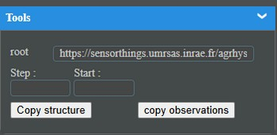

# [STEAN](./intro.md)

## Copie :

Le Query (dans la partie Tools) permet de copier un ou partie d'un service existant :

Pour cela il suffit de se placer dans le service dans lequel on veut importer les données, de renseigner le root et de cliquer sur Copy structure, et donc toute la structure du modèle et lue et inseré dans le service, une fois cette operation effectué vous pouvez lancer Copy observations, qui peut s'averer tres longue en fonction de la volumetrie a gérer (ce qui permet d'apprecier le confort du stream csv).

il est noter que l'option canDrop prends tout son sens ici : http://rootApi/Drop permet de supprimer les donnees vant une copie.
