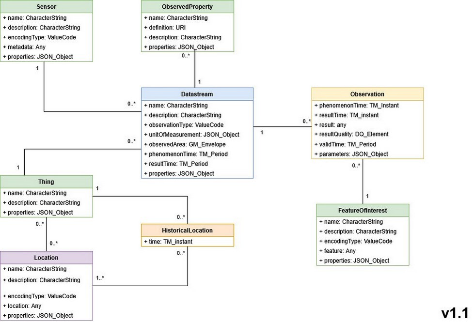

# STEAN

## SOMAIRE

- [Genése](./genese.md)
- [installer](./installer.md)
- [Importer / Exporter](./importer.md)
- [Copier](./copier.md)
- [Formats](./formats.md)
- [multiDatastream](./multiDatastream.md)
- [Lora](./lora.md)
- [Etats](./etats.md)
- [Users et token](./users.md)

## MODELE

