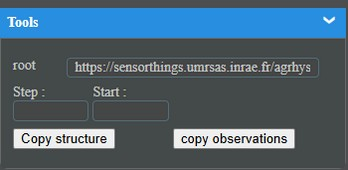

# [STEAN](./documentation.md)

## Query :

Le Query est la base un outil réservé au gestionnaire de données il ne faut pas le voir comme un client destiné à un utilisateur final ce n’est pas sa vocation.

Pour cela il suffit de se placer dans le service dans lequel on veut importer les données, de renseigner le root et de cliquer sur Copy structure, et donc toute la structure du modèle et lue et inséré dans le service, une fois cette opération effectuée vous pouvez lancer Copy observations, qui peut s'avérer très longue en fonction de la volumétrie à gérer (ce qui permet d'apprécier le confort du stream csv).

Il est noté que l'option canDrop prend tout son sens ici : http://rootApi/Drop permet de supprimer les données avant une copie.

